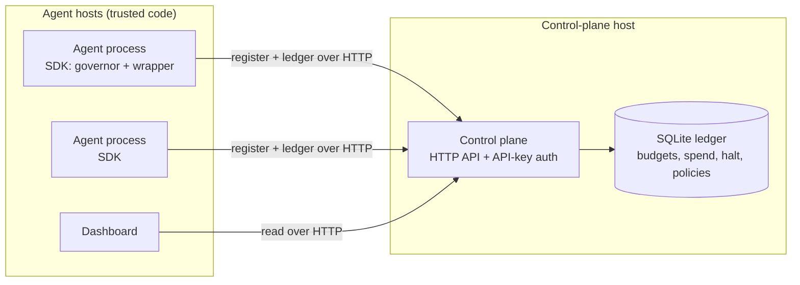

# Threat model

This document describes what TokenOps is designed to protect, the trust
boundaries in each deployment mode, and how to harden a deployment. It is a
companion to the trust-model section of [`SECURITY.md`](../../SECURITY.md).

## What TokenOps protects

TokenOps keeps a run-scoped ledger of spend and stops a run at its budget,
before the money is spent rather than after the invoice. It is designed to
contain **cost**, whether the overspend comes from honest failure (runaway
loops, retries, prompts that balloon) or from content an agent reads redirecting
it into wasteful behavior (indirect prompt injection).

It is a **cost guardrail, not a security boundary.** It assumes the agents it
governs are yours and are not actively working to defeat enforcement. If you run
agent code you do not control, treat TokenOps as a cost control, not as access
control.

## Deployment modes

### Single-process (default)

The agent, the governor, and the ledger are one process. Nothing crosses a
network boundary; the ledger is in-process state. There is no meaningful attack
surface beyond your own code.

### Shared mode (multi-process)

Multiple agent processes, and optionally a dashboard, share one budget by talking
to a control plane over HTTP. The control plane owns the ledger.

The trust boundary is the network hop between an agent host and the control-plane
host. The intended invariant is that **the control plane is the only process that
opens the ledger.** Agents reach spend, halt, and budget state only through the
HTTP API, where the plane can authenticate the caller.

## Known limitations

- **Enforcement is in-process.** Governance is applied by wrapping your
  model-call function. A code path that calls the model without the wrapper is
  not counted. Keep model access behind the governed wrapper.
- **The reference Docker deployment shares the ledger file.** In the current
  bundled `docker-compose` setup, agent containers mount the ledger database on a
  shared volume rather than reaching it only through the plane. An agent with
  file access can therefore read or change ledger state directly. This is a known
  gap; the hardened path below closes it.
- **Ledger authorization on the plane is coarse.** The control plane
  authenticates callers with scoped API keys, but ledger routes do not yet check
  that a caller owns the run or segment it acts on. Until per-tenant
  authorization lands, treat any holder of a valid ingest key as trusted for all
  runs.

## Hardening

1. **Run the shared control plane**
   ([`agentplane-control-plane`](https://github.com/theagentplane/control-plane))
   and point agents at it over HTTP. Do not hand agents a database path. The
   plane becomes the only writer, which removes direct ledger access from agents.
2. **Enable API keys** so the plane rejects unknown callers. Use the narrowest
   scope each caller needs (`read`, `ingest`, or `admin`).
3. **Do not expose the plane port publicly.** Keep it on an internal network;
   the plane is infrastructure, not a public endpoint.
4. **Keep model access behind the governed wrapper** so no call path escapes
   accounting.

## Reporting

Report suspected vulnerabilities privately via
[GitHub Security Advisories](https://github.com/theagentplane/tokenops/security/advisories/new).
Please do not open a public issue. See [`SECURITY.md`](../../SECURITY.md).
